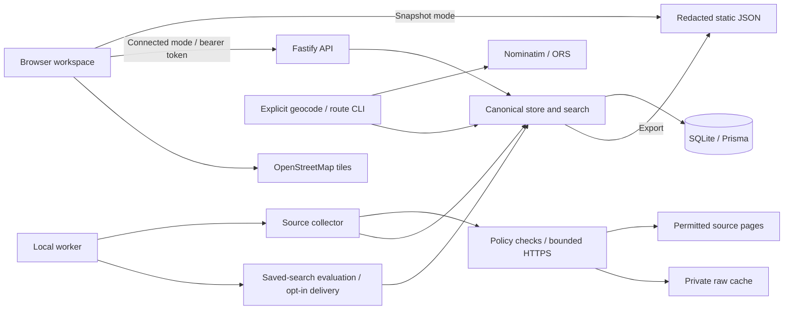

# Architecture and developer reference

Updated September 8, 2026 UTC from the implemented code. This is a single-user local application with a separately distributable static frontend. The original requirements are in [MuscleCarPrompt.md](../MuscleCarPrompt.md); known implementation gaps are in [FUTURE_IMPROVEMENTS.md](../FUTURE_IMPROVEMENTS.md).

## Data flow

The browser keeps functioning without maps or a backend through its published snapshot. Static hosting cannot execute the database, collector or private alerts. A snapshot refresh updates the source JSON; an existing production build/deployment remains dated until rebuilt or intentionally refreshed.

## Module responsibilities

- `app/page.tsx` hosts the client workspace in `components/MuscleScout.tsx`; `WorkspaceTools.tsx` holds manual entry, reviewed corrections and duplicate review; `ListingMap.tsx` provides Leaflet maps. Next App Router exports static HTML/assets, with unoptimized original-source image URLs. The workspace route uses browser state and shared search; it is not a Next server/API application.
- `shared/schema.ts` is the canonical Zod v1 contract and defaults v1. It covers identity, listing price/bid/availability, seller versus actual vehicle location, route provenance, evidence-bearing specifications, timestamps, public snapshot, private workspace, saved searches and settings. `shared/search.ts` is used by browser, backend and alerts. Database key columns support identity/lookups while JSON payload retains flexible specifications.
- `server/index.ts` starts Fastify; `server/api.ts` owns authentication and APIs. Password comes from private environment, is scrypt-hashed per process, compared in constant time; random 8-hour bearer tokens are stored hashed in an in-memory map. Restarting the API invalidates existing sessions. Exact allowed Origin checks, loopback binding by default, request rate limits and a 5 MB body limit are implemented. There is one private `personal` workspace, not multiple user accounts.
- `server/store.ts` owns listing merge/upsert, separate observation streams, first-seen preservation, user overrides, grouping, snapshot redaction, settings/home-route invalidation, stale projection and renewable leases. Older cached observations cannot replace newer canonical information.
- `server/ingest/collector.ts` runs enabled configured sources serially with a global collection lease. Source-specific card/detail parsers live in `adapters.ts`, supplemental marketplace parsers in `marketplace-parsers.mjs`, normalized extraction in `normalize.ts`. `safe-fetch.ts` validates allowed HTTPS origins, public resolved IP addresses and same-origin GET redirects, pins DNS resolution, enforces request size/time bounds, respects robots, throttles by origin, and caches raw content privately by hash.
- `server/worker.ts` polls every 10 seconds under a separate 30-minute worker lease renewed every 30 seconds. It runs durable collection requests or due interval collection (default 24 hours), then evaluates saved searches and attempts due external digests. It runs only while its local process is running; it is not a macOS LaunchAgent, Windows service, hosted cron or Codex automation. Setup initializes last-collection to setup time, so a new install does not immediately auto-collect.
- `server/geography.ts` provides explicit CLI geocoding and routing. Public Nominatim calls are serialized with a 15-second per-origin interval within one process, cached by provider/city/state query. ORS uses driving-car, no traffic, avoids ferries/borders, caches by provider and exact endpoints/options. Missing ORS key returns an explicit no-op. Geocoding/routing are not automatic worker steps.
- `server/alerts.ts` evaluates saved-search snapshots with quiet first baselines. Source-ad ID is the alert identity. Asking-price changes use a max($250, 1%) threshold; auction bids and 24-hour deadline reminders require opt-in. Availability changes are separate. External delivery requires environment destination, enabled backend setting and the search's channel. Failed network attempts back off through six attempts; stable IDs support receiver deduplication but cannot guarantee exactly once.

## Persistence inventory

`Listing`, `Observation`, `IngestRun`, `Lease`, `Setting`, `Workspace`, `SavedSearch`, `Alert`, `DeliveryAttempt`, `GeoCache` and `GroupReview` are Prisma SQLite tables. Two migrations initialize this schema and add bid/deadline alert preferences. `Observation` stores source payloads, asking-price, bid, availability and user-correction events separately. Private raw evidence is in ignored `data/research` and `data/cache`; a DB-only backup does not preserve these files. Source definitions and source allowlists are tracked in `config/sources.json`; credentials and runtime endpoints remain in `.env`; runtime user settings are in the database. The snapshot is a redacted derived artifact under `public/data/snapshot.json`.

Browser snapshot/sample workspaces are independent of the database and require their own private UI export for backup. Keys include app namespace, deployment path and mode; connected/session keys additionally include backend. Connected state is stored through optimistic workspace revisions and returns 409 instead of overwriting a concurrent edit. Connected bearer sessions survive reload in the tab through sessionStorage, while the password is not stored. Source-ad notes/favorites survive grouping because IDs are retained.

## API inventory

All routes except health, login and OPTIONS require Bearer authentication; requests with a supplied unapproved Origin are rejected even for public routes.

| Method and path | Purpose / contract |
|---|---|
| GET `/health` | Application/status/schema identity. |
| POST `/api/login` | `{password}` -> token, expiry; 8 attempts/minute. |
| POST `/api/logout` | Invalidates current token. |
| POST `/api/search` | Full shared Search schema -> rows/rawCount/groupCount using private favorites. |
| GET `/api/snapshot` | Private inventory, coverage and latest 60 ingest runs; no export redaction. |
| GET `/api/workspace` | Workspace and revision. |
| PUT `/api/workspace` | `{workspace, revision}`; synchronizes saved searches, resets their baseline when filters change; 409 conflict protection. |
| GET `/api/settings` | Runtime settings, no environment secrets. |
| PUT `/api/settings` | `{settings, dryRun}`; validates full configuration; home change invalidates all routes. |
| POST `/api/import` | `{listings}` up to 5,000; accepted count and indexed rejections; canonical data only, no source fetching. |
| GET `/api/listings/:id/history` | Ask/bid/availability history only, ascending observation time. |
| PATCH `/api/listings/:id/location` | Location-schema body; reviewed location override and route invalidation. |
| PATCH `/api/listings/:id/review` | `{year, specialtyEvidence, vehicleLocation, reason}`; durable override plus user-correction observation, route invalidation. |
| GET `/api/groups/review` | Weak exact normalized-title/model/year pairs requiring user review. |
| POST `/api/groups/merge` | `{ids, reason}` (2–20); new reviewed group retains former group identities in audit record. |
| POST `/api/groups/unmerge` | `{groupId}`; restores prior group identities, marks review reversed. |
| POST `/api/collect` | `{scope: regional|nationwide}` -> queued; requires running worker. |
| POST `/api/collection/expand` | Enables nationwide setting and queues broader job. |
| GET `/api/alerts` | Latest 100 persisted alerts. |
| GET `/api/delivery-attempts` | Latest 100 delivery attempts/failures. |
| POST `/api/alerts/:id/read` | Marks alert read. |

## Repository map

| Path | Responsibility |
|---|---|
| `app/` | Static App Router entry, metadata and responsive theme/styles. |
| `components/` | Workspace views, manual/review tools and Leaflet map. |
| `shared/` | Canonical versioned contracts, predicates, defaults, safe grouping and fictional development examples. |
| `server/` | API, data access, geography, network guardrails, alert evaluation and worker. |
| `server/ingest/` | Source-specific parsers, normalizer and bounded orchestration. |
| `prisma/` | Database schema and two ordered SQLite migrations; Prisma configuration is at the project root. |
| `config/` | Source feasibility/query definitions and dated vehicle/routing reference facts. |
| `scripts/` | Setup, launch, CLI, static server/export verification, isolated browser-test API, initial research import and SBOM generation. |
| `tests/` | Portable fixtures, unit/API tests and browser workflow tests. |
| `public/data/` | Redacted real snapshot consumed by static mode; no backend workspace. |
| `docs/` | Research archives, architecture/operations and generated dependency evidence. |
| `data/`, `backups/` | Private ignored local state; `.gitkeep` is the sole tracked-data placeholder. |
| `.github/`, `.vscode/` | Manual Pages publication workflow and local task definitions. |

## Canonical contracts and search

The schema/defaults versions start at 1. A `Listing` is a **source advertisement** with stable source identity, not a claim of one unique physical car. `groupId` is a reversible relation across advertisements. Price observations are source-specific. `specs` and `fieldEvidence` hold values with basis/source/time; current adapters populate only evidence they can actually extract. A field being expressible or filterable in the schema does not mean every source supplies it.

The vehicle predicate combines classic model/year eligibility with an optional selected specialty-Mustang branch, then applies common geography/price/status/preferences. Target year limits do not invent nonexistent models; advertised year/half-year text and identity-review status remain distinct. Route eligibility requires established actual vehicle location and a fresh non-future estimate at or below the selected minutes. Seller coordinates, straight-line miles and off-site stock do not substitute for it.

`Search`, `Workspace`, `SavedSearch` and `Settings` are validated contracts. Independent filters combine with AND; selected states combine with OR. Saved searches retain their own defaults version and preferences. Backend search, the client and alert evaluation use the same predicates, but input projections must also agree: the current static-export availability-aging gap is documented in the backlog.

A missing value stays unknown. Asking prices, auction bids, monthly financing, deposits, buyer premiums and odometer claims must not be merged into comparable numbers without evidence. Engine displacement does not become horsepower. Identity decoding or a copied seller claim never authenticates the physical car.

## Collection, evidence and lifecycle

Source `config/sources.json` statuses describe initial feasibility; latest `IngestRun` status describes the last attempted run. The UI combines both. Sources are independent, have explicit HTTPS origins and retain public source URLs. Raw bodies are cached once by SHA-256 under `data/cache`; metadata retains original network observation time. Initial research evidence lives under `data/research`. Those private files are referenced by local observations and omitted from public output.

Collection uses a renewable global lease, per-source run records, source delays, catalog/detail caps and exact source IDs. Fresh detail records are skipped; attempted details rotate within rediscovered candidates. Catalog cursors are not yet durable across cycles. Counts such as `remainingEnrichment` describe that run's encountered IDs, not all retained source inventory. Neither an outer `finished` cycle nor a source `complete` status proves market completeness.

The merge path retains first-tracked time, rich detail values when sparse summaries omit them, original price evidence dates and durable user overrides. A newer source observation is not proof that every retained field was reobserved. Explicit changed/off-site location evidence invalidates routes. Read-time staleness does not imply a sale. Source failures and missing pages never establish removal.

Automatic grouping is deliberately narrow. The review heuristic is currently weak exact-title matching with a 15-pair UI limit. No automatic group was formed in the initial real collection. Detailed duplicate metrics and the proposed reconciliation work are in the improvement register.

## Security and publication boundary

- Default API binding is loopback; remote hosting needs deliberate network/TLS configuration and exact allowed origins. CORS is not a replacement for authentication.
- Public health/login are narrow exceptions. Bearer token values are never placed in URLs or long-lived localStorage; in-memory server sessions expire on restart and after eight hours.
- Source fetches permit only HTTPS/public resolved addresses and configured origins, pin DNS resolution, bound redirects/body/time, and stop on access restrictions. Imported records do not trigger arbitrary network fetching.
- Remote prose is rendered as text. Map tooltips/popups use DOM text content for listing data. Source photos can fail independently and have a neutral fallback.
- Real imports reject sample records. Public export omits configured sources, full identifier fields, raw evidence references, original seller prose and private overrides/workspace. Contact-pattern redaction and source-hosted images do not constitute blanket redistribution permission.
- The database, raw cache, environment, backups, build outputs and browser-test artifacts are ignored by Git. Public snapshot and source/SBOM documentation are explicit distributable artifacts, subject to review before publication.

## Extension rules

Add a source only after verifying permitted access and stable catalog/detail identity; save sanitized fixtures, test pagination/sale semantics, then run a small dated live check. A fixture-only adapter must not be called live-validated. Add a field through the shared schema and source evidence, then test identical filter behavior in browser/API/alerts. Preserve original source data and version private workspace/schema changes deliberately.

Before widening strong grouping, build conflict and false-positive fixtures. Before widening geography, verify route options/freshness and keep unknowns visible. Before optimizing national-scale search, benchmark and preserve shared predicate parity. Review [operations](OPERATIONS.md), [SBOM](../SBOM.md) and [future work](../FUTURE_IMPROVEMENTS.md) when changing deployment or dependencies.
