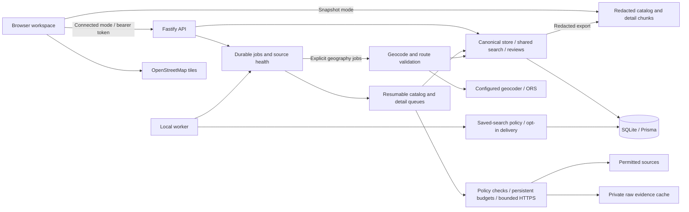

# Architecture and developer reference

Updated September 8, 2026 UTC from the integrated implementation. MuscleScout is a single-user local application with a separately distributable static frontend. The original requirements are in [MuscleCarPrompt.md](../MuscleCarPrompt.md); the implementation map and remaining acceptance work are in [IMPROVEMENTS_STATUS.md](IMPROVEMENTS_STATUS.md) and [FUTURE_IMPROVEMENTS.md](../FUTURE_IMPROVEMENTS.md).

## Data flow

The published snapshot works without a backend or maps. Static hosting cannot execute the collector, database or private alerts. Updating the source JSON does not update an existing static build or deployment until it is rebuilt or intentionally refreshed.

## Module responsibilities

| Area | Main implementation |
|---|---|
| Browser workspace | `app/page.tsx`, `components/MuscleScout.tsx`, `WorkspaceTools.tsx`, `ListingMap.tsx`; static Next App Router output with client state. |
| Shared contracts and search | `shared/schema.ts`, `shared/search.ts`; versioned Zod contracts, time-dependent projection, eligibility, filtering, sorting and grouping shared by browser, API and alerts. |
| Catalog transport | `shared/catalog.ts`, `server/store.ts`; public full snapshot, compact searchable catalog, lossless dictionary transport and lazy exact-ad detail chunks. |
| API and storage | `server/index.ts`, `api.ts`, `store.ts`; authentication, optimistic workspace revisions, listing/observation merge, settings, export and renewable leases. |
| Collection operations | `server/ingest/operations.ts`, `state.ts`, `collector.ts`, `failures.ts`, `server/collection-api.ts`; durable jobs, checkpoints, detail queues, failure classification and access reviews. |
| Parsing and scope | `server/ingest/adapters.ts`, `marketplace-parsers.mjs`, `normalize.ts`, `scope-validation.ts`; source identity, evidence extraction, URL scope and terminal-page validation. |
| Network and geography | `server/safe-fetch.ts`, `service-budget.ts`, `geography.ts`, `shared/location-merge.ts`; bounded requests, cross-process budgets, validated locations and fresh route caches. |
| Duplicate reconciliation | `shared/duplicates.ts`, `server/grouping.ts`, `components/DuplicateReview.tsx`; candidate indexes, evidence/conflict ranking, auditable decisions and reversible reviewed merges. |
| Field review | `shared/reviews.ts`, `server/reviews.ts`, `components/EvidenceTimeline.tsx`; source baseline, durable overrides, field evidence, paginated observation timeline and safe reset. |
| Alerts and delivery | `shared/alert-policy.ts`, `server/alerts.ts`, `delivery-policy.ts`, `components/DeliveryAttempts.tsx`; group/ad policy, quiet baselines, leased frozen digests and reviewed retries. |
| Worker and operations UI | `server/worker.ts`, `components/OperationsPanel.tsx`; scheduled collection, explicit geography jobs, status/cancel/retry, source review and provider budgets. |
| Authorized feeds | `server/ingest/authorized-feed.ts`, `ebay-browse.ts`, `scripts/import-feed.ts`; permission-bearing import manifests and bounded licensed-provider adapter support. |
| Browser integration | `shared/webmcp.ts`, `scripts/diagnose-browser-context.mjs`; optional native browser context tools with validated partial-filter updates and diagnostics. |

The API uses a private environment password, scrypt comparison, and random eight-hour bearer tokens stored hashed in memory. API restart invalidates sessions. It binds loopback by default, checks exact allowed origins, rate-limits requests and caps bodies at 5 MB. It has one `personal` workspace, not multiple accounts. The frontend is not a Next API server.

## Persistence inventory

Prisma tables remain `Listing`, `Observation`, `IngestRun`, `Lease`, `Setting`, `Workspace`, `SavedSearch`, `Alert`, `DeliveryAttempt`, `GeoCache` and `GroupReview`. The two ordered migrations initialize the schema and add bid/deadline preferences. New operational records use namespaced JSON in `Setting`, so the improvements do not require replacing existing listing, workspace or history data.

| State | Key or table | Meaning |
|---|---|---|
| Job | `collection:v1:job:<uuid>` | Kind, scope/caps, status, heartbeat, attempts, cancellation, result and next eligible run. |
| Catalog progress | `collection:v1:catalog:<source>:<scope>:<configured-URL-hash>` | Separate query seeds, FIFO page tasks, attempts, terminal evidence, original observation time and cycle completion. |
| Detail progress | `collection:v1:details:<source>` | Source-wide tasks keyed by stable ad ID, with discovered scopes/query IDs and independent attempt/due dates. |
| Source health | `collection:v1:health:<source>` | Active/cooldown/review/smoke-required state, classified failure, next permitted time and bounded review history. |
| Schedule | `collection:v1:schedule` | Last attempt/completion and next due interval. Legacy `last-collection` remains compatible; old `collection-request` is migrated to a real job. |
| Provider budget | `service-budget:<service-or-origin>` | UTC-day reservations, next request slot and persisted cooldown/reason. |
| Geography fairness | `geo-attempt:<ad-id>`, `route-attempt:<ad-id>` | Last attempted time used to rotate eligible work across restarts. |
| Geography result | `GeoCache` | Versioned provider/address geocode keys and route keys derived from endpoints/options; observation age is validated on reads. |
| Duplicate review | `grouping-base-v1`, `seller-aliases-v1`, `duplicate-decisions-v1`; `GroupReview` | Stable automatic-group baseline, reviewed aliases/pair decisions, merge/undo audit events. |
| Delivery | `DeliveryAttempt`; `delivery-batch:<hash>`, `delivery-retry:<attempt-id>:<time>` | Per-alert attempts, frozen batch membership/stable deduplication identity and manual retry audit. |
| Feed import | `feed-receipt:<feed-id>:<content-hash>`, `feed-progress:<feed-id>:<scope>:<query-hash>` | Exact-page idempotency, manifest receipt and declared query cursor continuity. |

The operational adapter performs compare-and-swap writes so cancellation and worker checkpoints cannot silently overwrite each other. Leases separately protect the worker cycle, collection, geocoding, routing, alert evaluation and delivery; expiration is recovery support, not permission to run concurrently with an active owner.

`Observation` separates source payloads, asks, bids, availability and user review events. Raw evidence remains in ignored `data/cache` and `data/research`; database-only backup cannot recover those files. Sources/origins are tracked in `config/sources.json`; credentials/endpoints remain in `.env` and user settings in SQLite.

`operations:bootstrap` imports existing inventory and historical run evidence into missing operational queues/health entirely offline. It retains original listing scope and observation dates, uses `legacy-observation` query attribution, and creates no jobs, network requests, listing observations or fictional catalog completion. Existing new-state records win. This bootstrap was executed on the local real inventory; its report is [operations-bootstrap.json](validation/operations-bootstrap.json).

Browser snapshot/sample workspaces remain independent of the database. Storage keys include application, base path and mode; connected/session keys also include backend. Connected updates require the latest workspace revision and return 409 on conflict. Tokens use tab sessionStorage; passwords are not stored. Stable source-ad IDs preserve notes/favorites when grouping changes.

## API inventory

All routes except health, login and OPTIONS require bearer authentication. A supplied unapproved Origin is rejected even on those public routes. Detailed Zod validation is in `server/api.ts` and `server/collection-api.ts`.

| Method and path | Purpose / contract |
|---|---|
| GET `/health` | Application/status/schema identity. |
| POST `/api/login`; POST `/api/logout` | Password login (8 attempts/minute), token expiry and session invalidation. |
| POST `/api/search` | Shared Search body; complete rows, raw ad count and group count. |
| POST `/api/search/page` | `{filters, offset, limit}`; paginated results and counts using the same predicate/projection. |
| GET `/api/snapshot` | Private inventory/coverage and recent runs; not a publication-safe export. |
| GET/PUT `/api/workspace` | Read or update `{workspace, revision}`; synchronize saved searches; 409 conflict protection. |
| GET/PUT `/api/settings` | Read or validate/save `{settings, dryRun}`; full settings parse; home changes invalidate routes. |
| POST `/api/import` | `{listings}` up to 5,000 canonical records; indexed rejections; no source requests. |
| GET `/api/listings/:id/history` | Ask/bid/availability observations in ascending time. |
| PATCH `/api/listings/:id/location` | Legacy location correction, now routed through reviewed evidence handling. |
| PATCH `/api/listings/:id/review` | Optional year, specialty evidence and/or actual vehicle location plus reason. |
| POST `/api/listings/:id/review/reset` | Reasoned reset to retained source baseline; 409 if a safe legacy baseline is absent. |
| GET `/api/listings/:id/provenance` | Current/source/override values and paginated source/review events (`offset`, `limit`). |
| GET `/api/groups/review` | Ranked candidate evidence, conflicts, decisions and merge audit; paginated, optionally includes dismissed pairs. |
| POST `/api/groups/merge` | 2–100 ad IDs and reason; identifier conflicts require explicit acknowledgement. |
| POST `/api/groups/unmerge` | `{reviewId}` or legacy `{groupId}`; replay remaining review edges instead of restoring obsolete assignments. |
| POST `/api/groups/decision` | Two IDs, dismissed/restored action and reason. |
| PUT `/api/groups/aliases` | Auditable seller-alias registry used for candidate review. |
| POST `/api/collect`; POST `/api/jobs` | Enqueue separate UUID jobs: collection/geocode/routes, regional/nationwide scope, optional source/caps/limit/smoke. |
| GET `/api/jobs`; GET `/api/jobs/:id` | Durable job history or one job. |
| POST `/api/jobs/:id/cancel`; POST `/api/jobs/:id/retry` | Cooperative cancellation or explicit retry retaining history/progress. |
| GET `/api/collection/progress` | Catalog checkpoints, source-wide queues and scope summaries; optional `sourceId`. |
| GET `/api/source-health` | Current access state and dated failure/review history. |
| POST `/api/source-health/:sourceId/review` | Pause or request bounded smoke with an 8–2,000-character reason. Cannot grant source permission or override Retry-After. |
| POST `/api/collection/expand` | Enable nationwide setting and enqueue a nationwide collection job. |
| GET `/api/service-budgets` | Persisted provider request reservations and cooldowns. |
| POST `/api/listings/:id/geocode/retry` | Reasoned invalidation of this query's cached geocode/route and attempt marker; eligible for the next explicit geocoder run. |
| GET `/api/alerts`; POST `/api/alerts/:id/read` | Latest 100 alerts and read state. |
| GET `/api/delivery-attempts`; POST `/api/delivery-attempts/:id/retry` | Latest 100 attempts and audited retry; uncertain outcomes require acknowledgement. |

Job statuses are queued, running, partial, interrupted, completed, failed and cancelled. A partial result with `nextRunAt: null` is waiting for explicit work/review, not secretly scheduled. Cancellation takes effect at bounded work boundaries. Collection caps permit zero through the API, useful for separate catalog/detail passes; CLI examples use positive caps. Source selection applies only to collection. Geocode/routes jobs use their explicit item limit and are never created by scheduled collection.

## Canonical search and public transport

A `Listing` is a source advertisement. `groupId` is a reversible relation, not a claim that a heuristic has authenticated one physical car. Price/history remain ad-specific. Specifications and field evidence carry basis/source/time; unavailable values remain unknown. An identifier or seller claim alone does not authenticate a vehicle.

The shared predicate combines the classic model/year branch with selected specialty Mustang eligibility, then applies common geography, price, state, availability and preferences. Unknown/review paths remain visible. Actual location and a fresh, non-future route are required for driving-time eligibility; seller coordinates, straight-line miles or off-site stock cannot substitute. One evaluation clock is propagated through matching, projection and sorting. Staleness/auction freshness are projected consistently for full and compact snapshots, API pages and alerts.

Public export writes `snapshot.json`, dictionary-packed `catalog.json` and hashed detail chunks. `catalogListing` retains all top-level searchable fields because arbitrary field filters can address them; only specification metadata outside predicate-visible value/basis is deferred. The dictionary envelope is `musclescout-dictionary-v1`; explicit container tags prevent user objects/arrays from colliding with reference markers. Decoder checks cover bounds, duplicate keys and malformed references. The browser decodes before schema parsing and resolves a selected ad through its exact `detailFiles` entry. Full snapshot remains available for compatible consumers.

Connected page search reads projected database columns in 500-row ID batches, with safe indexed prefilters for sources and small favorites sets. It still retains all matching ads for correct sort/group selection, and each offset request rescans candidates. The 50,000-ad synthetic benchmark checks full/compact/decoded/page/alert predicate parity and measures time, bytes, memory and candidate comparisons; it is not proof of bounded browser memory or production database performance. See [scale-50000.json](validation/scale-50000.json). Future top-K/group-aware selection or revision-keyed result caching must preserve representative choice, order and counts.

## Collection, access and evidence

Catalog checkpoints are keyed by source, requested scope and configured URL set. Query attribution survives pagination. Canonical URLs suppress duplicate work; scope guards reject pagination that drifts to a different configured query. Successful pages append discovered pages and detail IDs to durable queues. Tiny repeated caps therefore advance existing queues instead of rebuilding the first pages. Detail tasks survive independently of rediscovery and report both source-wide and scoped backlog. A completed catalog cycle can refresh later according to cache policy.

Terminal-page evidence includes original observation time, parser version and cache identity. Reports distinguish configured scope, observed inventory, incomplete traversal, stale evidence and complete traversal of a declared query. Neither queue exhaustion nor removing a travel filter establishes nationwide market completeness. `coverage:report` is offline and cannot refresh live validation dates.

Failures distinguish access, policy, layout, rate limits, server/network errors, missing pages, budgets and cancellation. Access/policy failures pause for review; transient failures receive bounded retries/cooldowns. Source review requires a reason and a successful bounded live smoke before normal access resumes. Reviews retain server Retry-After. Cache hits preserve their network observation time and do not consume new network request reservations. Raw source failures never establish a sale/removal.

`safe-fetch.ts` allows configured credential-free HTTPS origins/public DNS destinations, pins DNS resolution, permits bounded same-origin GET redirects, limits size/time and checks robots. Persistent origin/provider budgets reserve slots atomically across CLI/API/worker processes and survive restart; counts represent accepted reservations, including a slot whose later network attempt fails or is cancelled. Daily limits reset by UTC day, while cooldowns survive that reset.

## Geography, groups, reviews and delivery

Geocoder results must agree with requested US city/state/country and acceptable feature evidence. Ambiguous/unsupported results enter review rather than acquiring trusted coordinates. Cache reads enforce provider identity and configured age; future cache times are rejected. Last-attempt records rotate eligible work fairly; ambiguous entries require explicit correction/retry. A provider lease prevents concurrent geography batches, and shared budgets enforce request spacing and daily limits across processes. Defaults include a conservative 15-second public geocoder interval and 100 geocoder requests/day.

ORS uses driving-car, no live traffic, and ferry/border avoidance. Route keys include exact endpoints/options; reads enforce routeMaxAgeDays. Changing home or actual vehicle location invalidates route evidence. An unchanged source address preserves its validated geocode/route across later sparse observations. Missing ORS credentials returns unavailable without fabricating travel estimates. Real provider behavior still needs an authorized route test.

Duplicate candidate indexes combine valid identifiers, normalized seller/stock context, aliases, model/year, distinctive title evidence and corroborating attributes. Strong identifier conflicts prevent automatic joining. Manual review can acknowledge a documented conflict; dismissed pairs and reversed reviews cannot be silently recreated by ingestion. Active review edges replay over the automatic-group baseline, supporting overlapping/nested merge undo. There is no permanent 15-pair review ceiling; that is a page size. Candidate indexing reduces typical comparisons, but a dense individual bucket can still generate quadratic work. Matching photos are not treated as authenticated identity evidence.

User corrections preserve source baseline and explicit override separately; year/specialty/location review carries reason/date and observation history. Reset requires a real retained source baseline and recalculates derived eligibility; changing/restoring location invalidates travel evidence. Public export removes these private review details.

Saved searches support vehicle-group or source-ad alert policy and optional crosspost notifications. Quiet first baselines and stable membership avoid manufactured new-car alerts after regrouping; price/bid/availability history stays ad-level. A renewable delivery lease freezes digest membership and deduplication IDs. SMTP has bounded connection/socket and overall deadlines. Transient failures retry up to six times, permanent failures stop, and interrupted/timed-out sends become uncertain. Manual retry retains the same batch key and requires acknowledgement when the receiver may already have accepted it. Exactly-once delivery cannot be guaranteed without receiver cooperation. Environment destination, enabled backend setting and search-channel opt-in are all required; no real external delivery was performed for fixture validation.

## Security, repository and extension boundaries

Public export redacts configured sources, restricted/expired feed content, full identifiers, raw references, original seller prose, contact patterns and private workspace/override data. Source-hosted photos can independently fail; the photo component tries only the selected ad's own gallery and then a neutral fallback. Remote prose and map content are rendered as text. Imports reject fictional sample rows in real mode and do not trigger arbitrary URL fetching.

Private `.env`, SQLite, raw evidence, backups, build outputs and test artifacts remain ignored. Directories/files receive owner-only access where supported. Source-hosted image URLs or redacted content still require an appropriate redistribution basis. Authorized feed manifests declare provider permission, expiry, query/scope and pagination; byte-identical receipts are idempotent. The eBay adapter requires actual approved credentials and reviewed vehicle-category scope; scaffolding does not confer access.

`app/` and `components/` hold UI; `shared/` holds portable contracts/policy; `server/` holds backend logic; `prisma/` holds schema/migrations; `config/` holds source/reference definitions; `scripts/` holds setup/operations/build/release tools; `tests/` holds sanitized fixtures and isolated tests; `public/data/` holds distributable exports; `docs/` holds dated evidence. `.github/` contains pinned CI/manual publication workflows. Generated local-service definitions are opt-in and do not install themselves.

Read the installed Next guides under `node_modules/next/dist/docs/` before changing framework code. Add a source only after permitted access and identity/scope semantics are established; save sanitized fixtures before a bounded dated live check. Extend shared fields/predicates with full/compact/API/alert parity tests. Keep the [operations guide](OPERATIONS.md), [SBOM](../SBOM.md), [validation ledger](../VALIDATION.md) and improvement tracker aligned with actual evidence, not only configured capabilities.
